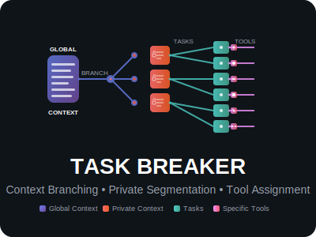

# Task Breaker

<div align="center">
  

  **An AI Agent Framework for Breaking Down Complex Tasks**

  [](https://golang.org)
  [](LICENSE)
  [](https://platform.openai.com/docs/api-reference/chat)

</div>

## Overview

Task Breaker is a Go-based AI agent framework designed for building intelligent applications that can communicate with any AI provider using the industry-standard OpenAI Chat Completions API format. Built with hot-swappable backends, comprehensive testing, and production-ready architecture.

### 🎯 Key Features

- **🔄 Provider Agnostic** - Switch between OpenAI, Claude, local models, or any OpenAI-compatible API
- **🔌 Hot-Swappable Backends** - Change AI providers without modifying your application logic
- **📋 Context Management** - Load and manage context from files for informed AI conversations
- **⚡ Concurrent Safe** - Built for high-performance, multi-threaded applications
- **🧪 Comprehensive Testing** - Full test coverage with unit, integration, and benchmark tests
- **📚 Standards Compliant** - Implements OpenAI Chat Completions API specification
- **🛡️ Production Ready** - Error handling, timeouts, retries, and monitoring built-in

## Quick Start

### Installation

```bash
git clone https://github.com/jeanhaley32/task-breaker.git
cd task-breaker
go mod download
```

### Basic Usage

```go
package main

import (
    "context"
    "fmt"
    "log"

    "github.com/jeanhaley/task-breaker/ai"
    "github.com/jeanhaley/task-breaker/backends/mock"
)

func main() {
    // Initialize backend
    backend := mock.NewMockBackend()

    // Create agent
    agent := NewAgent("MyAgent", backend)

    // Send a message using OpenAI Chat Completions format
    messages := []ai.Message{
        {Role: "system", Content: "You are a helpful assistant"},
        {Role: "user", Content: "Hello, how are you?"},
    }

    response, err := agent.SendChatCompletion(messages)
    if err != nil {
        log.Fatal(err)
    }

    fmt.Printf("AI Response: %s\n", response.Choices[0].Message.Content)
}
```

### With Context Loading

```bash
# Create a context file
echo "You are a Go programming expert. Always provide working code examples." > context.txt

# Run with context
go run main.go context.txt
```

## Architecture

### Interface-Based Design

Task Breaker uses a clean interface-based architecture that separates concerns:

```go
type Backend interface {
    ChatCompletion(ctx context.Context, req ChatCompletionRequest) (*ChatCompletionResponse, error)
    SendMessage(ctx context.Context, req Request) (*Response, error)
    IsAvailable(ctx context.Context) bool
    Configure(config map[string]interface{}) error
    Name() string
}
```

### Supported Backends

| Backend | Status | Description |
|---------|---------|-------------|
| Mock | ✅ Available | Testing and development backend |
| OpenAI | 🚧 Planned | GPT-4, GPT-3.5-turbo, etc. |
| Claude | 🚧 Planned | Anthropic's Claude models |
| Local | 🚧 Planned | Ollama, LM Studio, etc. |

## OpenAI Chat Completions Standard

Task Breaker implements the industry-standard OpenAI Chat Completions API format, ensuring compatibility with virtually all modern AI providers:

```json
{
  "model": "gpt-4",
  "messages": [
    {"role": "system", "content": "You are a helpful assistant"},
    {"role": "user", "content": "Hello!"}
  ],
  "max_tokens": 150,
  "temperature": 0.7
}
```

**Why This Standard?**
- **Universal Compatibility** - Works with OpenAI, Claude, local models, and more
- **Industry Adoption** - Supported by most AI tools and libraries
- **Future-Proof** - New providers typically implement this format
- **Rich Ecosystem** - Extensive documentation and community support

📖 **[Read the complete OpenAI Protocol Guide →](ai/README.md)**

## Project Structure

```
task-breaker/
├── ai/                     # Core AI interfaces and types
│   ├── interface.go        # OpenAI-compatible interface definitions
│   ├── interface_test.go   # Interface unit tests
│   └── README.md          # OpenAI Chat Completions documentation
├── backends/              # AI backend implementations
│   └── mock/             # Mock backend for testing
│       ├── mock.go
│       └── mock_test.go
├── main.go               # Agent implementation and demo
├── agent_test.go         # Agent functionality tests
├── context.txt           # Sample context file
└── README.md             # This file
```

## Development

### Running Tests

```bash
# Run all tests
go test ./...

# Run tests with coverage
go test -cover ./...

# Run specific test package
go test ./ai
go test ./backends/mock

# Run benchmarks
go test -bench=. ./...
```

### Test Coverage

The project maintains comprehensive test coverage:

- **Interface Types** - JSON serialization, validation, edge cases
- **Mock Backend** - All methods, error handling, concurrency
- **Agent Functionality** - Message sending, context loading, timeouts
- **Integration Tests** - End-to-end scenarios and real-world usage
- **Benchmarks** - Performance testing for optimization

### Example Test Output

```bash
$ go test ./...
ok      github.com/jeanhaley/task-breaker/ai           0.003s
ok      github.com/jeanhaley/task-breaker/backends/mock 0.105s
ok      github.com/jeanhaley/task-breaker              0.158s
```

## Examples

### Simple Q&A System

```go
request := ai.ChatCompletionRequest{
    Model: "gpt-4",
    Messages: []ai.Message{
        {Role: "user", Content: "What is the capital of France?"},
    },
    MaxTokens: &[]int{50}[0],
    Temperature: &[]float64{0.1}[0], // Low temperature for factual answers
}

response, err := backend.ChatCompletion(ctx, request)
```

### Code Assistant

```go
request := ai.ChatCompletionRequest{
    Model: "gpt-4",
    Messages: []ai.Message{
        {Role: "system", Content: "You are a Go programming expert."},
        {Role: "user", Content: "How do I read a JSON file in Go?"},
    },
    MaxTokens: &[]int{500}[0],
    Temperature: &[]float64{0.3}[0],
}
```

### Multi-turn Conversation

```go
type Conversation struct {
    messages []ai.Message
}

func (c *Conversation) AddUserMessage(content string) {
    c.messages = append(c.messages, ai.Message{
        Role: "user", Content: content,
    })
}

func (c *Conversation) SendRequest(backend ai.Backend) (*ai.ChatCompletionResponse, error) {
    return backend.ChatCompletion(context.Background(), ai.ChatCompletionRequest{
        Model: "gpt-4",
        Messages: c.messages,
    })
}
```

## Configuration

### Backend Configuration

Each backend can be configured with provider-specific settings:

```go
backend := mock.NewMockBackend()
err := backend.Configure(map[string]interface{}{
    "name": "CustomMock",
    "response_delay": "200ms",
    "error_rate": 0.0,
})
```

### Agent Configuration

Agents can be configured with context and behavior settings:

```go
agent := NewAgent("MyAgent", backend)

// Load context from file
err := agent.LoadContext("system-instructions.txt")

// Or set context directly
agent.context = "You are a helpful programming assistant."
```

## Contributing

We welcome contributions! Here's how to get started:

1. **Fork the repository**
2. **Create a feature branch**: `git checkout -b feature/amazing-feature`
3. **Write tests** for your changes
4. **Ensure all tests pass**: `go test ./...`
5. **Commit your changes**: `git commit -m 'Add amazing feature'`
6. **Push to your branch**: `git push origin feature/amazing-feature`
7. **Open a Pull Request**

### Development Guidelines

- **Test Coverage**: All new code must include comprehensive tests
- **Documentation**: Update relevant documentation for any interface changes
- **Code Style**: Follow standard Go conventions (`gofmt`, `golint`)
- **OpenAI Compatibility**: Ensure new backends implement the standard correctly

## Use Cases

Task Breaker is perfect for:

- **🤖 AI-Powered Applications** - Chat interfaces, content generation, analysis tools
- **🔄 Multi-Provider Solutions** - Applications that need to switch between AI providers
- **🧪 AI Experimentation** - Testing different models and comparing responses
- **🏢 Enterprise Applications** - Production systems requiring reliability and monitoring
- **📚 Educational Projects** - Learning AI integration and Go development
- **🛠️ Development Tools** - Code assistants, documentation generators, testing tools

## Hackathon Ready

Task Breaker was designed specifically for rapid development and hackathon environments:

- **⚡ Quick Setup** - Clone and run in minutes
- **🔄 Easy Backend Switching** - Test different AI providers effortlessly
- **📝 Context Management** - Load instructions and knowledge from files
- **🧪 Mock Backend** - Develop without API costs
- **📚 Comprehensive Docs** - Everything you need to get started
- **🏗️ Extensible Architecture** - Add features without breaking existing code

## Roadmap

### v0.2.0 - Real Backends
- [ ] OpenAI backend implementation
- [ ] Claude backend implementation
- [ ] Configuration management
- [ ] Rate limiting and retry logic

### v0.3.0 - Advanced Features
- [ ] Local model backends (Ollama, LM Studio)
- [ ] Streaming response support
- [ ] Function calling capabilities
- [ ] Conversation persistence

### v0.4.0 - Production Features
- [ ] Load balancing across providers
- [ ] Circuit breaker patterns
- [ ] Metrics and monitoring
- [ ] Docker containerization

## License

This project is licensed under the MIT License - see the [LICENSE](LICENSE) file for details.

## Acknowledgments

- **OpenAI** for creating the Chat Completions standard
- **Anthropic** for Claude compatibility layers
- **Go Community** for excellent tooling and libraries
- **Hackathon Organizers** for providing the inspiration to build this

---

<div align="center">
  <strong>Built with ❤️ for the AI development community</strong>

  [Report Bug](https://github.com/jeanhaley32/task-breaker/issues) •
  [Request Feature](https://github.com/jeanhaley32/task-breaker/issues) •
  [Documentation](ai/README.md)
</div>